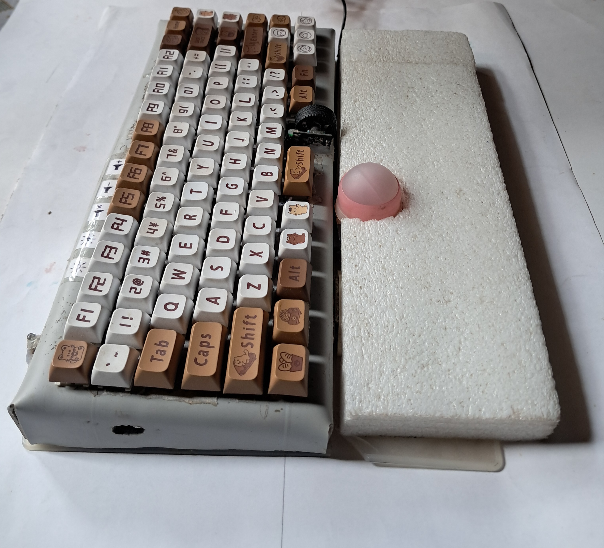

# Grid
# Custom Mechanical Keyboard + DIY Ball Mouse  
### Built Raspberry Pi Pico

This is a fully functional 75% mechanical keyboard and custom ball-style mouse, built entirely from scratch using PVC pipes, recycled hardware, and a Raspberry Pi Pico running [KMK](https://github.com/KMKfw/kmk_firmware). It supports layers, macros, mouse emulation, a physical scroll wheel, and multimedia controls. The custom mouse is inspired by Pimoroni's ball mouse, utilizing the sensor from an old mouse and a homemade housing.

---

## Demonstration

  

[Watch the full demonstration video](media/demo_video.mp4) to see the keyboard and mouse in action.

---

## Features

### Keyboard

- 75% mechanical layout with full key support
- Layered keymaps (Default, Media, Macro, Utility)
- Multimedia and system controls:
  - Volume up/down, mute
  - Brightness control
  - Play/Pause
- Physical scroll wheel:
  - Scroll through documents or pages
  - Adjust brightness or volume on specific layers
- Mouse emulation using keyboard:
  - Cursor movement via Arrow keys or Vim-style (H, J, K, L)
  - Left and right click support
- Macro recording and playback:
  - Capture and repeat sequences of keystrokes

### Custom Ball Mouse

- Based on a Pimoroni-style ball mouse
- Uses the optical sensor and components from a repurposed classic mouse
- Mounted in a PVC or 3D printed housing
- Physical trackball for smooth cursor control
- Integrated buttons for left/right click

---

## Media

### Keyboard Overview

### Ball Mouse Overview

---

## Hardware Used

### Keyboard

- PVC pipe frame
- Raspberry Pi Pico
- Mechanical switches
- Keycaps
- Diodes (1N4148)
- Rotary encoder (for scroll wheel)
- Wires, solder, and prototype board
- KMK firmware running on CircuitPython

### Mouse

- Optical sensor and board from an old USB mouse
- Trackball (recycled from ball roller)
- PVC or 3D printed shell
- Tactile switches for buttons
- Connected via USB or directly to Pico

---

## Folder Structure

